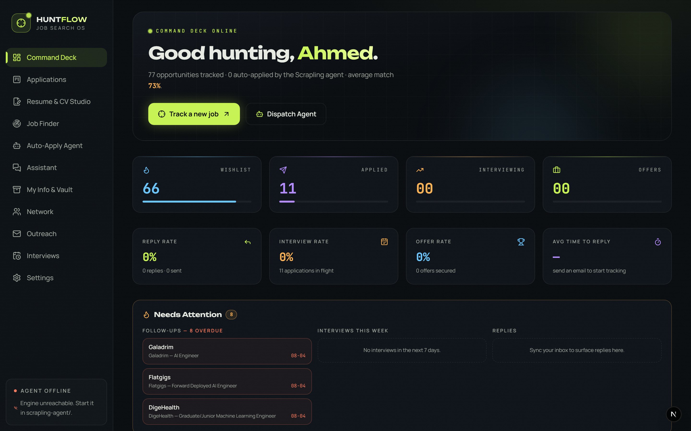
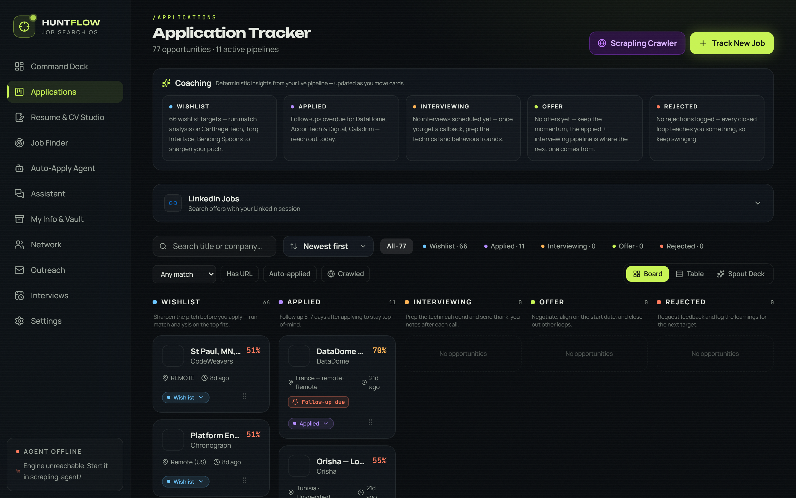
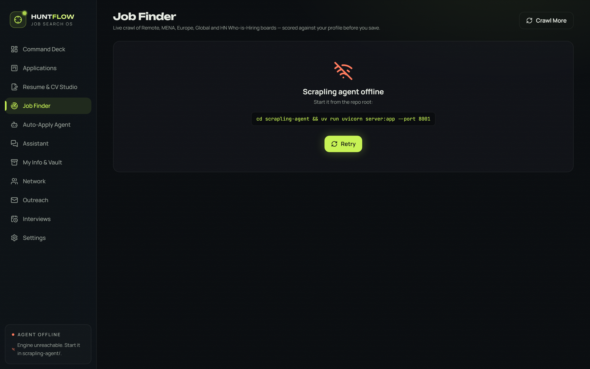
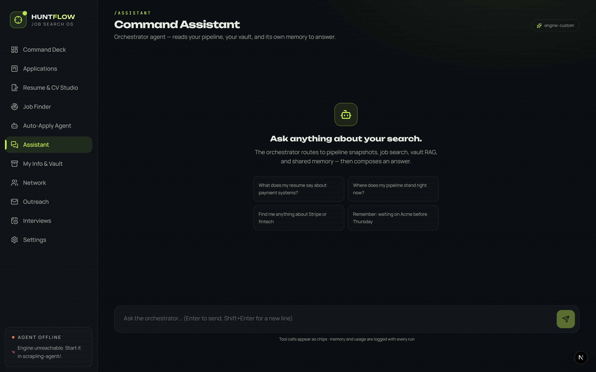
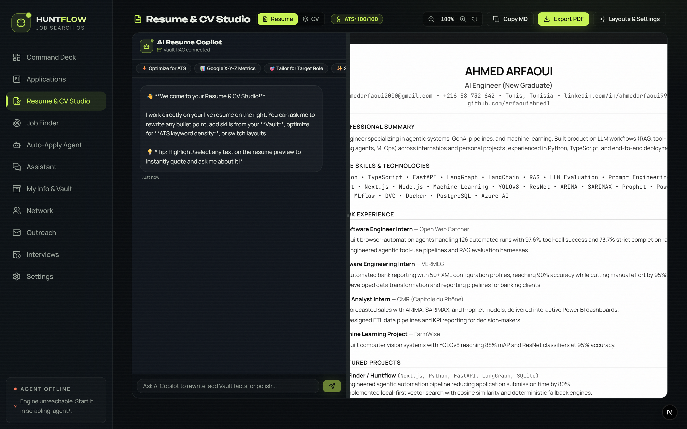
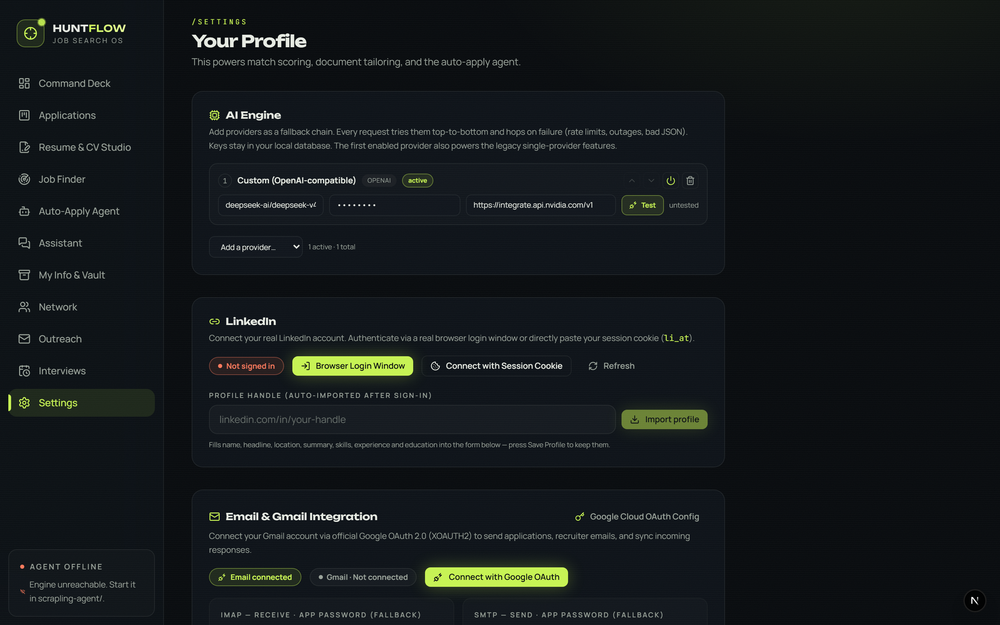

<p align="center">
  
</p>

<h1 align="center">HUNTFLOW</h1>
<h3 align="center">The AI-Powered Job Search OS — <em>Bring Your Own Keys, Own Your Data</em></h3>

<p align="center">
  <a href="https://github.com/arfaouiahmed1/huntflow"></a>
  
  
  
  
</p>

<br/>

> **Stop paying for job-search SaaS subscriptions. Run the whole stack on your machine with your own AI keys.**
> HUNTFLOW is a local-first, self-hosted job search platform that brings enterprise-grade AI to your job hunt —
> without subscriptions, cloud lock-in, or anyone reading your resume.

<p align="center">
  
</p>

---

## 🔑 BYOK — Bring Your Own Keys

HUNTFLOW is built around a **Bring Your Own Key** model. You connect the AI providers you already have — no middleman, no markup.

| Provider | Models | Cost |
|---|---|---|
| **OpenAI** | GPT-4o, GPT-4.1, o3-mini | Your API pricing |
| **Anthropic** | Claude Sonnet, Claude Opus | Your API pricing |
| **Google Gemini** | Gemini 2.5 Pro/Flash | Your API pricing |
| **OpenRouter** | 200+ models from one key | Your API pricing |
| **Groq** | Llama 3, Mixtral (ultra-fast) | Your API pricing |
| **DeepSeek** | DeepSeek V3, R1 | Your API pricing |
| **Ollama** | Any local model (Llama, Mistral…) | **Free — runs offline** |
| **Custom** | Any OpenAI-compatible endpoint | Your API pricing |

**Stack providers in priority order.** HUNTFLOW's LLM router tries them in sequence with automatic fallback and a circuit breaker — if one fails, the next kicks in instantly.

> 💡 **Run entirely free**: configure Ollama with a local model and pay $0 for every generation.

---

## ✨ What HUNTFLOW Does

### 📋 Pipeline Tracker
Full Kanban-style job board — Wishlist → Applied → Interviewing → Offer / Rejected. Track match scores, salary, notes, follow-up due dates, and per-job activity logs.

<p align="center">
  
</p>

---

### 🤖 AI Generation Suite
Generate everything a job application needs, tailored to each role:

- **Tailored Resume & Cover Letter** — personalized to the job description
- **ATS Match Analysis** — skills gap report vs. the JD
- **STAR Flashcards** — behavioural interview prep from your experience
- **Interview Questions** — predicted questions + model answers
- **Job Brief** — company snapshot, role context, salary intel
- **Global Insights** — pipeline health report, skill roadmap, recommendations

Every generation is **budget-clamped** and **cost-tracked** in the usage ledger.

<p align="center">
  
</p>

---

### 💬 Command Assistant
An AI chat agent (LangGraph) that knows your entire pipeline. Ask it to:
- Summarize your job search status
- Find jobs by keyword or company
- Search your document vault semantically
- Remember facts across sessions

Works with **or without** an API key (heuristic fallbacks).

<p align="center">
  
</p>

---

### 📄 Resume Copilot & Document Vault
Upload your resumes, cover letters, and references (PDF, DOCX, plain text). They are chunked, embedded, and semantically searchable. The Resume Copilot generates and iterates on tailored resumes in-app.

<p align="center">
  
</p>

---

### ⚙️ AI Engine Settings — BYOK Made Simple
Add, reorder, enable/disable, and test providers from one clean UI. Keys are stored **encrypted in your local SQLite DB** and never sent to any server.

<p align="center">
  
</p>

---

### 🕷️ Auto-Apply Agent
A LangGraph agent that scores the job against your profile, writes a pitch, then drives the **Scrapling browser agent** to prefill or submit application forms — fully autonomous.

```
analyze → decide → prepare → execute → verify
```

Falls back to a guided simulation if the Scrapling agent is offline.

---

## 🏗️ Architecture — Local-First by Design

```
┌─────────────────────────────────────────────────┐
│              Your Browser (Next.js 15)           │
│   Dashboard · Tracker · Assistant · Vault · ...  │
└─────────────────┬───────────────────────────────┘
                  │ API Routes (Next.js)
┌─────────────────▼───────────────────────────────┐
│                LLM Router                        │
│  Provider Chain → Retry → Fallback → Breaker     │
│  OpenAI · Gemini · Anthropic · Ollama · ...      │
└─────────┬──────────────────────┬────────────────┘
          │                      │
┌─────────▼──────┐   ┌──────────▼──────────────┐
│  SQLite DB     │   │  Scrapling Browser Agent │
│  huntflow.db   │   │  (Python / port 8001)    │
│  (your machine)│   │  Scraping · Auto-Apply   │
└────────────────┘   └──────────────────────────┘
```

**No cloud. No accounts. No vendor lock-in.** Everything lives in `data/huntflow.db`.

---

## 🚀 Quickstart

**Prerequisites**: Node.js 18+, npm

```bash
git clone https://github.com/arfaouiahmed1/huntflow.git
cd huntflow
npm install
npm run dev
```

Open **http://localhost:3000** — the app seeds itself on first load.

### Production Build

```bash
npm run build
npm run start
```

### Optional: Scrapling Browser Agent (auto-apply + LinkedIn scraping)

```bash
cd scrapling-agent
uv sync                        # install Python deps
uv run scrapling install       # download browsers (once)
uv run uvicorn server:app --port 8001
```

If offline, scraping and auto-apply fall back gracefully.

---

## 🔧 Configuration

### Via Settings UI (recommended)
Go to **Settings → AI Engine**, add your API keys, pick models, and drag to reorder provider priority.

### Via Environment Variables
Copy `.env.local.example` to `.env.local` and fill in your keys:

```env
OPENROUTER_API_KEY=sk-or-...
OPENAI_API_KEY=sk-...
GEMINI_API_KEY=AIza...
ANTHROPIC_API_KEY=sk-ant-...
GROQ_API_KEY=gsk_...
DEEPSEEK_API_KEY=sk-...
# Ollama runs locally — no key needed
OLLAMA_BASE_URL=http://localhost:11434
```

Keys set via env are auto-detected on startup. Model overrides: `OPENAI_MODEL=gpt-4o`, etc.

---

## 📊 Usage & Cost Tracking

Every LLM call is logged — provider, model, token counts, latency, and estimated cost. View the full ledger in **Settings → Usage**. Budget clamps prevent runaway spend.

---

## 🛡️ Privacy & Security

- ✅ **All data stays on your machine** — SQLite file at `data/huntflow.db`
- ✅ **API keys stored locally** — masked in DB, never returned to the browser unmasked
- ✅ **No telemetry** — zero analytics or tracking
- ✅ **No accounts** — no sign-up, no email, no cloud sync
- ✅ **Offline capable** — heuristic fallbacks work without any API key

---

## 📁 Scripts

| Script | Description |
|---|---|
| `npm run dev` | Start dev server (port 3000) |
| `npm run build` | Production build |
| `npm run start` | Serve production build |
| `npm run lint` | Run ESLint |
| `npm run test` | Run Vitest unit tests |

---

## 📚 Documentation

- [`docs/ARCHITECTURE.md`](docs/ARCHITECTURE.md) — System context, data model, LLM router, agent graphs, vault/RAG pipeline, security and limitations.

---

<p align="center">
  Built with ❤️ for job seekers who value privacy and control.<br/>
  <strong>Your job search. Your data. Your keys.</strong>
</p>
