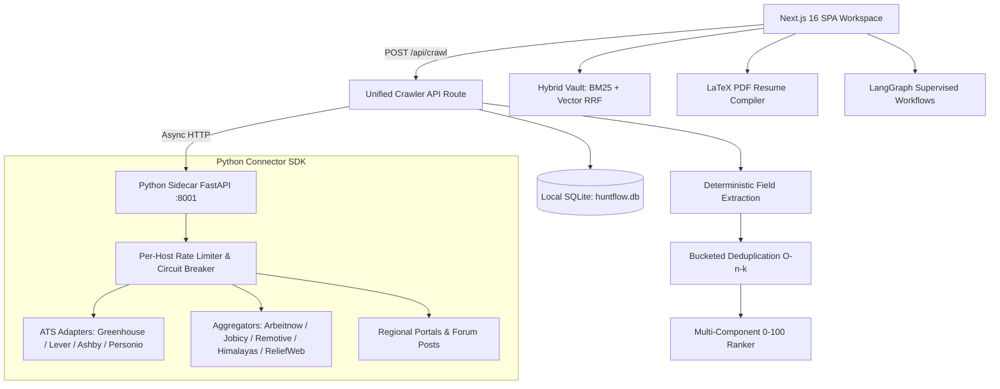

# HUNTFLOW

### A private AI career workspace for finding, evaluating, tailoring, and tracking opportunities.

[](https://github.com/arfaouiahmed1/huntflow/actions/workflows/ci.yml)
[](LICENSE)


HUNTFLOW turns the fragmented job-search workflow into one auditable, local-first system: collect opportunities from a global crawler network, compare them against a real candidate profile, produce role-specific application material, and keep every important action under human control.

It is designed as a single-user, local-first product and an engineering showcase—not as a hosted multi-tenant SaaS.

> **Trust boundary:** local records and uploaded source files are stored on your machine in `data/huntflow.db`. Content is sent outside the app only when you configure and invoke an external model, Gmail, scraping, or job-source provider. Run HUNTFLOW on a trusted machine and do not expose it directly to the public internet.

---

## Product Surfaces

- **Global Crawler Network** — demand-driven multi-channel discovery across direct public ATS feeds (Greenhouse, Lever, Ashby, SmartRecruiters, Personio, Recruitee, Workable), open aggregators (Arbeitnow, Jobicy, Remotive, Himalayas, ReliefWeb), regional feeds (Americas, Europe, MENA including Tunisia, Africa, APAC), and curated non-whiteboard companies.
- **Channels & Faceted Filters** — uncluttered mental model: select plain-language channels (`All public feeds`, `Company career systems`, `Remote & global boards`, `Interview-friendly`), apply rich multi-select facets (region, work mode, seniority, tech tags, visa sponsorship, salary minimums), and inspect live source health in the Source Health Drawer.
- **Deterministic Field Extraction & Bucketed Deduplication** — extracts seniority, work modes, salary bands, and visa signals deterministically without an LLM. Scale-tested bucketed deduplication merges multiple sources and tracks provenance edges in SQLite.
- **Resume Studio** — LaTeX PDF is the **typography source of truth** (`ResumePdfPreview`, `SynctexViewer`), with structure preview fallback and diff preview.
- **Evidence Vault** — upload PDF, DOCX, TXT, and Markdown evidence; inspect chunks; and search with hybrid lexical (BM25) + vector retrieval.
- **Supervised Agent Workflows** — run research, profile analysis, document drafting, and browser preparation through LangGraph-backed orchestration with field, click, screenshot, and run-history evidence.
- **Human-Controlled Actions** — keep consequential external actions separate from autonomous research and drafting.

---

## Architecture



---

## Quickstart

### Prerequisites

- **Node.js**: `>=22.0.0 <23.0.0`
- **npm**: `v10+`
- **Python**: `>=3.10`
- **uv**: `v0.4+` (for Python sidecar)

### Native Setup (Development)

```bash
# 1. Clone repository
git clone https://github.com/arfaouiahmed1/huntflow.git
cd huntflow

# 2. Install Node dependencies
npm ci

# 3. Setup Python sidecar environment
cd scrapling-agent
uv sync --group dev
uv run scrapling install   # installs browser binaries (once)
cd ..

# 4. Create environment configuration
cp .env.example .env

# 5. Run diagnostic check
npm run doctor

# 6. Start development servers concurrently (Next.js :3000 + Sidecar :8001)
npm run dev
```

Open [http://localhost:3000](http://localhost:3000).

### Docker Setup

```bash
# 1. Clone and copy environment template
git clone https://github.com/arfaouiahmed1/huntflow.git
cd huntflow
cp .env.example .env

# 2. Build and start web workspace
docker compose up --build

# 3. (Optional) Start with Python sidecar agent
docker compose --profile agent up --build
```

---

## Repository Commands & Quality Gates

| Command | Description |
| --- | --- |
| `npm run check` | Runs ESLint and full TypeScript compilation (`tsc --noEmit`). |
| `npm run doctor` | Runs repository diagnostics (Node, npm, uv, SQLite, sources schema, sidecar status). |
| `npm run test:crawler` | Runs deterministic Vitest suite for crawler contracts, normalization, deduplication, and SQLite. |
| `npm run test:sidecar` | Runs Python pytest suite for all connector adapters and rate limiters. |
| `npm run test` | Runs the full Vitest test suite. |
| `npm run eval:agents:benchmark` | Runs 50-case empirical multi-agent evaluation on real toolchains with isolated SQLite. |
| `npm run sources:validate` | Validates `scrapling-agent/sources.json` against `source-registry.schema.json`. |
| `npm run check:env` | Verifies parity between codebase `process.env` references and `.env.example`. |
| `npm run enrichment:sync` | Synchronizes cited knowledge from licensed repositories into SQLite. |
| `npm run clean:local` | Safely clears compiler caches, temporary logs, and build artifacts. |
---

## Documentation Index

- [Crawler Architecture Guide](docs/CRAWLER-ARCHITECTURE.md)
- [Source Registry & Connector Guide](docs/SOURCE-REGISTRY.md)
- [Environment & Configuration Guide](docs/ENVIRONMENT.md)
- [Legal, Source Policy & Compliance Guide](docs/LEGAL-AND-SOURCE-POLICY.md)
- [Agent & Crawler Operations](docs/AGENT-OPERATIONS.md)
- [System Architecture](docs/ARCHITECTURE.md)
- [Deployment & Docker Guide](docs/DEPLOYMENT.md)
- [Privacy & Trust Boundaries](docs/TRUST-BOUNDARIES.md)
- [Resume Engine & LaTeX Typography](docs/RESUME-ENGINE.md)
- [RAG & Document Vault](docs/RAG-AND-DOCUMENT-VAULT.md)
- [Third-Party Notices & Attributions](THIRD_PARTY_NOTICES.md)
- [Contributing Guidelines](CONTRIBUTING.md)
- [Security Policy](SECURITY.md)
- [Code of Conduct](CODE_OF_CONDUCT.md)
- [Apache 2.0 License](LICENSE)
