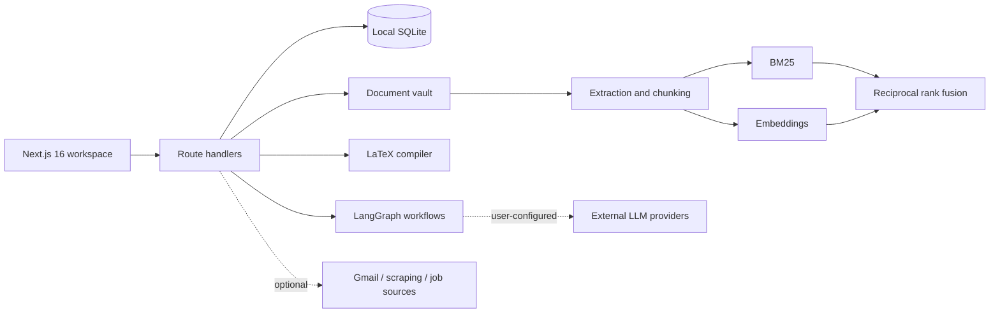

# HUNTFLOW

### A private AI career workspace for finding, evaluating, tailoring, and tracking opportunities.

[](https://github.com/arfaouiahmed1/huntflow/actions/workflows/ci.yml)
[](https://github.com/arfaouiahmed1/huntflow/actions/workflows/codeql.yml)


HUNTFLOW turns the fragmented job-search workflow into one auditable system: collect opportunities, compare them against a real candidate profile, produce role-specific application material, and keep every important action under human control.

It is designed as a single-user, local-first product and an engineering showcase—not as a hosted multi-tenant SaaS.

> **Trust boundary:** local records and uploaded source files are stored on your machine. Content is sent outside the app only when you configure and invoke an external model, Gmail, scraping, or job-source provider. Secrets are currently stored locally and are not encrypted at rest. Run HUNTFLOW only on a trusted machine and do not expose it directly to the public internet.

## Why HUNTFLOW is different

| Typical job tracker | HUNTFLOW |
| --- | --- |
| Stores links and statuses | Maintains an evidence-backed applicant profile and document vault |
| Generic keyword matching | Hybrid BM25 + vector retrieval over chunked documents |
| One-shot AI generation | Supervised agent workflows with visible stages and approval gates |
| Browser-only resume styling | LaTeX-backed PDF export with explicit template typography |
| Hidden automation | Action tiers separate analysis, drafting, and external submission |

## Product surfaces

- **Opportunity workspace** — import, enrich, score, compare, and track job listings.
- **Discovery Control** — choose individual scraper sources, start runs explicitly, and inspect live telemetry plus per-source outcomes.
- **Resume Studio** — select a LaTeX template, tailor content, inspect an A4 structure preview, and compile a PDF.
- **Evidence Vault** — upload PDF, DOCX, TXT, and Markdown evidence; inspect chunks; and search with hybrid retrieval.
- **Agent workflows** — run research, profile analysis, document drafting, and browser preparation through LangGraph-backed orchestration with field, click, screenshot, and run-history evidence.
- **Human-controlled actions** — keep consequential external actions separate from autonomous research and drafting.
- **Local operations** — use SQLite for application state and Docker volumes for persistence.

## What's new

- **Vault chunk inspector**: inspect the exact chunks produced from each uploaded document before retrieval touches them.
- **Hybrid RAG search with citation breakdown**: every vault result shows lexical rank, vector rank, matched terms, and the fused score behind it.
- **Live crawler board grid (SSE)**: watch per-source crawl outcomes stream into Discovery Control while a run is in flight.
- **Tracker explain-fit**: read a plain explanation of why a listing scored the way it did against your profile.
- **LaTeX agent loop with diff preview**: review proposed resume edits as diffs before anything compiles.
- **Short and long agent memory**: agents keep session-scoped notes alongside durable memory that survives across sessions.

## Resume Studio

The default ATS template now uses **Latin Modern Roman**, the modern form of the familiar Computer Modern LaTeX typeface. Sans-serif templates use Latin Modern Sans, and each template declares its typography in the UI.

The browser preview is intentionally labelled a **structure preview**. The downloadable artifact is compiled from the selected `.tex` template, so the PDF—not an HTML screenshot—is the visual source of truth.

HUNTFLOW does not claim that a template can guarantee an ATS outcome. It favors conventional headings, selectable text, restrained layout, and machine-readable content, then leaves validation to the user and the target application system.

[Read the resume engine documentation](docs/RESUME-ENGINE.md)

## Retrieval-augmented document vault

The vault uses a transparent retrieval pipeline:

```text
PDF / DOCX / TXT / MD
        ↓
    text extraction
        ↓
  deterministic chunks
        ↓
 BM25 lexical search ─┐
                     ├─ reciprocal rank fusion ─→ ranked evidence
 vector similarity ──┘
```

Search results expose the document, chunk, embedding model, lexical/vector ranks, matched terms, and final fused score. The current vector layer supports the configured embedding path and a deterministic local fallback; it is deliberately presented as a small, inspectable RAG system rather than a production-scale vector database.

[Read the RAG and vault documentation](docs/RAG-AND-DOCUMENT-VAULT.md)

## Architecture



The web process owns the UI, API routes, agent orchestration, SQLite database, and LaTeX toolchain. An optional Scrapling service can run beside it when browser-assisted collection is required.

## Installation

Choose your platform below, then pick a path. The Docker path is the fastest route to a working setup; the native path gives you hot reload for development. Both serve the app at [http://localhost:3000](http://localhost:3000).

On first boot the SQLite database creates its schema and applies migrations automatically (memory embeddings, expiry timestamps, and run IDs included). There are no manual migration steps.

### Windows

Run these commands in PowerShell. For the Docker path, Docker Desktop with the WSL2 backend is recommended.

**Path 1: Docker**

Prerequisite: [Docker Desktop](https://www.docker.com/products/docker-desktop/) with Compose v2.

```powershell
Copy-Item .env.docker.example .env
docker compose up --build
```

Open [http://localhost:3000](http://localhost:3000). Published ports bind to `127.0.0.1` only, so nothing is reachable from your network. Data persists in the `huntflow-data` volume. Review [the deployment guide](docs/DEPLOYMENT.md) before changing that boundary.

Optional Scrapling agent at `http://127.0.0.1:8001`:

```powershell
docker compose --profile agent up --build
```

**Path 2: Native (npm + uv)**

Prerequisites: Node.js 22+ and npm. Optional: MiKTeX or TeX Live for resume PDF compilation, and uv for the Scrapling sidecar.

```powershell
npm ci
npm run dev
```

Then open [http://localhost:3000](http://localhost:3000).

> **Warning:** `npm run dev` kills anything listening on ports 3000 and 8001 before starting (`scripts/predev.mjs`). Close other apps on those ports first.

Sidecar setup (once), then sidecar-only runs in a separate terminal:

```powershell
cd scrapling-agent
uv sync
uv run scrapling install   # downloads browsers, one time
cd ..
npm run dev:scrapling
```

### macOS

**Path 1: Docker**

Prerequisite: [Docker Desktop](https://www.docker.com/products/docker-desktop/) for Mac with Compose v2.

```bash
cp .env.docker.example .env
docker compose up --build
```

Open [http://localhost:3000](http://localhost:3000). Ports bind to `127.0.0.1` only and data persists in the `huntflow-data` volume. Add `--profile agent` to also start the Scrapling sidecar on `127.0.0.1:8001`.

**Path 2: Native (npm + uv)**

Prerequisites: `brew install node@22`. Optional: MacTeX for PDF compilation (`brew install --cask mactex`) and uv for the sidecar (`brew install uv`).

```bash
npm ci
npm run dev
```

The port warning from the Windows section applies here too: `npm run dev` clears ports 3000 and 8001 by design. Sidecar setup matches the Windows steps (`uv sync`, then `uv run scrapling install` inside `scrapling-agent/`).

### Linux

**Path 1: Docker**

Prerequisites: Docker Engine plus the Compose v2 plugin. On Debian/Ubuntu:

```bash
sudo apt install docker.io docker-compose-plugin
sudo usermod -aG docker $USER   # log out and back in afterwards
```

Use your distribution's equivalent packages elsewhere.

```bash
cp .env.docker.example .env
docker compose up --build
```

Open [http://localhost:3000](http://localhost:3000). Ports bind to `127.0.0.1` only and data persists in the `huntflow-data` volume. Add `--profile agent` for the sidecar on `127.0.0.1:8001`.

**Path 2: Native (npm + uv)**

Prerequisites: Node.js 22+ via [nvm](https://github.com/nvm-sh/nvm) (recommended) or distro packages (`sudo apt install nodejs npm`). Optional: a TeX distribution for PDF compilation (`sudo apt install texlive-full`, or the lighter `texlive` plus `latexmk`; on Fedora, `sudo dnf install texlive-scheme-full`) and uv for the sidecar.

```bash
npm ci
npm run dev
```

Same port warning as above. Sidecar setup: `cd scrapling-agent && uv sync && uv run scrapling install`, then `npm run dev:scrapling` in a second terminal.

### Optional: Cloudinary screenshots

Agent screenshots stay local under `.agent_runs/` unless you configure Cloudinary. Either add the three variables to your `.env`:

```bash
CLOUDINARY_CLOUD_NAME=your-cloud-name
CLOUDINARY_API_KEY=123456789012345
CLOUDINARY_API_SECRET=your-api-secret
```

…or enter the same values on the Settings page (Settings → Cloudinary Streaming & Parallel Crawler). Values saved in Settings win; any field left blank there falls back to `.env`. Leave both unset to keep screenshots local-only.

### Quality gates (native path)

```bash
npm run lint
npx tsc --noEmit
npm test
npm run build
npm run quality:react-doctor
```

`quality:react-doctor` runs the static React code-quality audit (`react-doctor`, development-only dependency). React development diagnostics (`react-scan`, `react-grab`) initialize only when `NODE_ENV=development` and `NEXT_PUBLIC_DISABLE_REACT_DEVTOOLS !== "1"`; set that variable to `1` to suppress them. They are excluded from production builds.

## Bring your own providers

HUNTFLOW can work with locally configured or remote AI providers. Provider credentials are never bundled with the repository. Start with `.env.docker.example`, configure only the integrations you need, and keep `.env` files out of version control.

Variables the Docker Compose file passes through (all optional; set only what you use):

| Variable | Purpose |
| --- | --- |
| `HUNTFLOW_AGENT_TOKEN` | Shared secret between the web app and the Scrapling sidecar. When set, every sidecar endpoint requires the `X-Huntflow-Token` header. |
| `HUNTFLOW_CRAWL_CONCURRENCY` | How many boards a crawl run processes in parallel inside the sidecar. Clamped to 1..16 (default 1 — raise it in Settings or Docker when you want faster sweeps). |
| `OPENAI_API_KEY`, `ANTHROPIC_API_KEY`, `GEMINI_API_KEY`, `OPENROUTER_API_KEY`, `GROQ_API_KEY`, `DEEPSEEK_API_KEY` | LLM provider keys for research, drafting, and analysis flows. |
| `CLOUDINARY_CLOUD_NAME`, `CLOUDINARY_API_KEY`, `CLOUDINARY_API_SECRET` | Optional. Streams agent screenshots to Cloudinary instead of keeping them local under `.agent_runs/`. |

Where your data lives by default:

| Data or action | Default location / behavior |
| --- | --- |
| Jobs, profile, settings, document metadata | Local SQLite database |
| Uploaded source files | Local `data/` storage or Docker volume |
| Resume templates | Repository-owned LaTeX templates |
| LLM prompts and retrieved context | Sent to the provider only when an AI flow is invoked |
| Gmail or scraping actions | Disabled until configured and explicitly used |

See [trust boundaries](docs/TRUST-BOUNDARIES.md) for the complete data-flow and security model.

## Engineering evidence

- More than 600 automated tests across unit, API, persistence, workflow, and feature paths.
- TypeScript, ESLint, production build, CI, and CodeQL checks.
- Next.js standalone output for a minimal production container boundary.
- SQLite health endpoint and Docker health checks.
- Deterministic local retrieval tests for ranking and fallbacks.

Passing tests are engineering evidence, not a claim of production security or universal compatibility.

## Documentation

- [Product positioning and demo narrative](docs/PRODUCT.md)
- [Intelligence principles and evaluation roadmap](docs/INTELLIGENCE-PRINCIPLES.md)
- [RAG and document vault](docs/RAG-AND-DOCUMENT-VAULT.md)
- [Resume and LaTeX engine](docs/RESUME-ENGINE.md)
- [Docker and deployment](docs/DEPLOYMENT.md)
- [Agent and crawler operations](docs/AGENT-OPERATIONS.md)
- [Privacy and trust boundaries](docs/TRUST-BOUNDARIES.md)
- [System architecture](docs/ARCHITECTURE.md)

## Roadmap

- Retrieval evaluation set with recall and ranking metrics.
- Encrypted local secret storage and hardened OAuth verification.
- Portable vault export/import and document lifecycle controls.
- Stronger semantic embedding options with explicit provider labeling.
- Hosted-mode authentication and tenant isolation before any public deployment.

## Status

HUNTFLOW is an active portfolio project. It is suitable for local evaluation and demonstrations. External submissions and integrations should remain supervised until the relevant provider, identity, and security controls have been reviewed.
