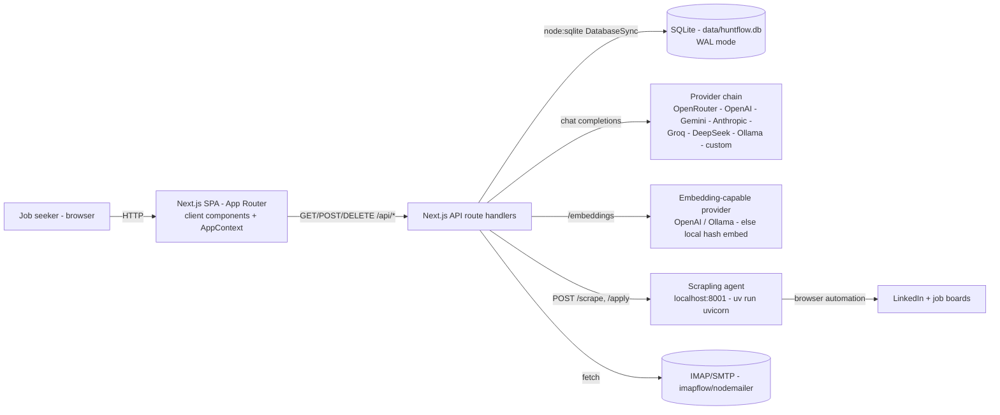
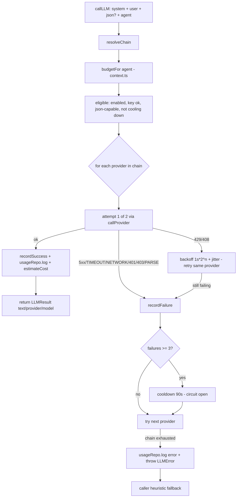
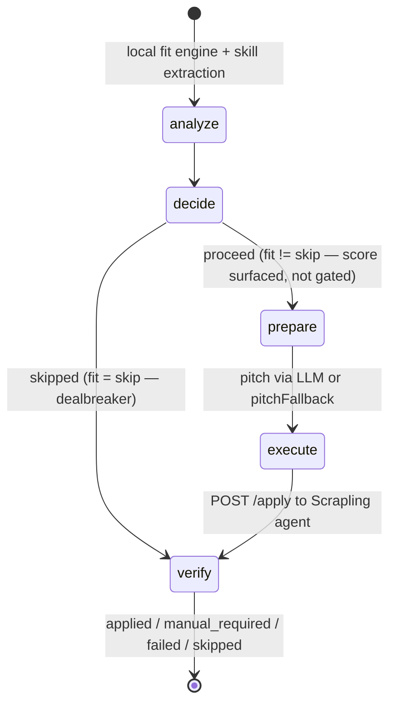
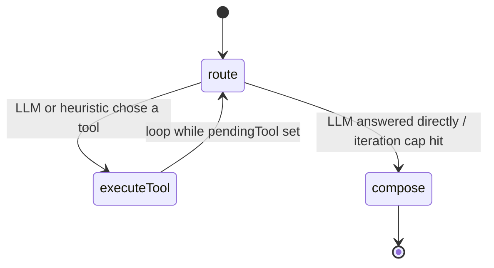
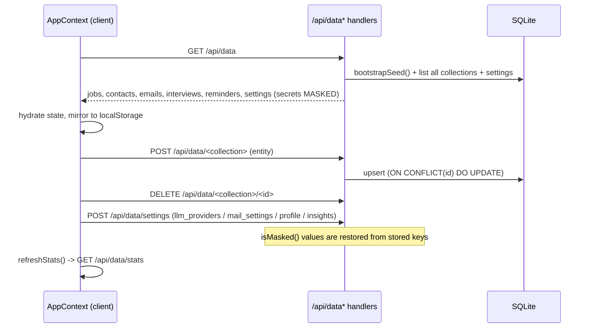
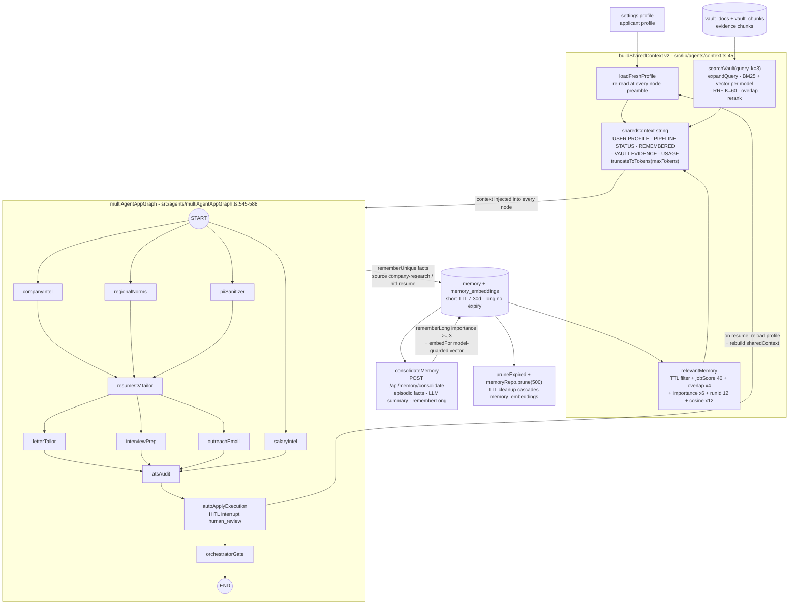

# HUNTFLOW - Architecture

HUNTFLOW is a single-user job-hunt copilot. The UI is a browser SPA built
on the Next.js App Router, and it talks to the server exclusively through
REST endpoints under `/api/*` - there are no server actions. The server
owns a local SQLite database (`data/huntflow.db`), drives a prioritized
chain of LLM providers, and delegates scraping, auto-apply and LinkedIn
work to a separate Scrapling agent (uv-managed, port 8001).

Key files: `src/lib/db.ts` (schema + repos), `src/lib/llm/*` (router,
providers, costs, budgets), `src/agents/*` (LangGraph state machines),
`src/context/AppContext.tsx` (client data hub), `scrapling-agent/`.

## 1. System context

All reads go through `GET /api/data` (a single hydration endpoint); all
writes go through `POST /api/data/<collection>` and
`DELETE /api/data/<collection>/<id>`. Feature APIs (`/api/generate`,
`/api/apply-agent`, `/api/scrape`, `/api/vault`, `/api/assistant`,
`/api/mail/*`, `/api/linkedin/*`) sit on the same database and the same
LLM router. The Scrapling agent is an out-of-process FastAPI/uvicorn
service the server calls for `/scrape` and `/apply`; when offline, the
server falls back to a built-in cheerio extractor for supported scrape
paths, while browser-assisted application runs fail safely.



## 2. Data model

SQLite via Node's built-in `node:sqlite` driver (`DatabaseSync`), created
lazily with WAL journaling, foreign keys and a 5s busy timeout
(`src/lib/db.ts:getDb`). Rich AI outputs (documents, flashcards, briefs,
skill gaps, auto-apply logs) are JSON columns on `jobs`. `settings` and
`meta` are key/value tables holding JSON blobs (below).

```mermaid
erDiagram
  jobs ||--o{ emails : "job_id"
  jobs ||--o{ interviews : "job_id"
  jobs ||--o{ reminders : "ref_id"
  contacts ||--o{ emails : "contact_id"
  vault_docs ||--o{ vault_chunks : "doc_id"
  memory ||--o{ memory_embeddings : "memory_id"
  jobs ||--o{ job_source_edges : "job_id"
  crawler_sources ||--o{ crawler_runs : "source_id"
  crawler_sources ||--o{ job_source_edges : "source_id"
  jobs {
    TEXT id PK
    TEXT title
    TEXT company
    TEXT status
    TEXT url
    TEXT job_description
    INTEGER match_score
    TEXT ai_outputs "JSON: skills_gap, documents,\nstar_flashcards, interview_questions,\njob_brief, salary_intel, auto_apply_logs"
    TEXT employer_review "JSON verdict"
    TEXT fit_category
    TEXT multi_agent_outputs "JSON"
    TEXT screenshot_url
    TEXT cloudinary_url
    TEXT skip_reason
    TEXT auto_apply_status
  }
  contacts {
    TEXT id PK
    TEXT name
    TEXT role
    TEXT company
    TEXT email
    TEXT company_ids "JSON"
  }
  emails {
    TEXT id PK
    TEXT contact_id FK
    TEXT job_id FK
    TEXT direction
    TEXT status
    TEXT sent_at
  }
  interviews {
    TEXT id PK
    TEXT job_id FK
    TEXT scheduled_at
    TEXT status
    INTEGER rating
  }
  reminders {
    TEXT id PK
    TEXT kind
    TEXT ref_id
    TEXT due_at
    INTEGER done
  }
  settings {
    TEXT key PK
    TEXT value "JSON blobs"
  }
  meta {
    TEXT key PK
    TEXT value "seed_version"
  }
  usage_log {
    INTEGER id PK
    TEXT agent
    TEXT kind "completion|embedding"
    TEXT provider
    TEXT status
    INTEGER prompt_tokens
    INTEGER completion_tokens
    REAL cost_est
  }
  memory {
    INTEGER id PK
    TEXT kind
    TEXT content
    TEXT job_id
    TEXT source
    INTEGER importance
    TEXT expires_at "TTL short-term\nNULL = long-term"
    TEXT run_id
  }
  memory_embeddings {
    INTEGER id PK
    INTEGER memory_id FK
    TEXT embedding "JSON array"
    TEXT model "local|provider|model"
  }
  agent_state {
    TEXT agent PK
    TEXT key PK
    TEXT value
  }
  vault_docs {
    TEXT id PK
    TEXT filename
    TEXT mime
    TEXT status "indexing|ready"
    TEXT embed_model "local or provider|model"
    TEXT label
    INTEGER chunk_count
  }
  vault_chunks {
    INTEGER id PK
    TEXT doc_id FK
    INTEGER idx
    TEXT content
    INTEGER tokens
    TEXT embedding "JSON array"
  }
  resume_docs {
    TEXT id PK
    TEXT name
    TEXT kind "resume|cv"
    TEXT template_id
    TEXT tex
    TEXT source_doc_id FK
    TEXT target_job_id FK
    INTEGER auto_compile
  }
  agent_checkpoints {
    TEXT thread_id PK
    TEXT checkpoint_ns PK
    TEXT checkpoint_id PK
    TEXT parent_checkpoint_id
    BLOB checkpoint
    BLOB metadata
  }
  agent_checkpoint_writes {
    TEXT thread_id PK
    TEXT checkpoint_ns PK
    TEXT checkpoint_id PK
    TEXT task_id PK
    INTEGER idx PK
    TEXT channel
    BLOB value
  }
  agent_run_history {
    INTEGER id PK
    TEXT thread_id
    TEXT job_id
    TEXT agent_name
    TEXT status
    INTEGER ats_score
    TEXT logs "JSON"
  }
  notifications {
    TEXT id PK
    TEXT title
    TEXT message
    TEXT kind
    TEXT link
    INTEGER read
  }
  crawler_sources {
    TEXT id PK
    TEXT name
    TEXT channel "ats|aggregator|regional|community|directory"
    TEXT crawl_policy "automatic|manual_only|disabled"
    INTEGER is_active
    INTEGER per_domain_rps
    TEXT config_json
  }
  crawler_source_state {
    TEXT source_id PK
    TEXT last_etag
    TEXT last_modified_header
    TEXT content_sha256
    TEXT health_status "healthy|degraded|unconfigured|disabled"
    INTEGER consecutive_failures
    INTEGER missing_runs_count
    TEXT circuit_open_until
  }
  crawler_runs {
    TEXT id PK
    TEXT source_id FK
    TEXT trigger_mode
    TEXT status "success|partial|failed"
    INTEGER jobs_found
    INTEGER jobs_ingested
    INTEGER duration_ms
    TEXT error_message
  }
  job_source_edges {
    INTEGER id PK
    TEXT job_id FK
    TEXT source_id FK
    TEXT external_id
    TEXT source_url
    TEXT first_seen_at
    TEXT last_seen_at
  }
  saved_searches {
    TEXT id PK
    TEXT name
    TEXT query
    TEXT filters_json
    INTEGER is_active
  }
```



Schema notes (`src/lib/db.ts`): `memory.expires_at` implements short-vs-long
memory — non-null ISO timestamps are short-term entries with a 7-30 day TTL,
null means long-term; vectors for memories live in the child table
`memory_embeddings` (model-labeled so local and provider spaces never mix).
`agent_checkpoints` + `agent_checkpoint_writes` back the LangGraph
`SqliteCheckpointSaver` (HITL interrupt/resume); `agent_run_history` records
per-thread runs; `notifications` powers the top-bar notification center;
`resume_docs` stores drafted `.tex` documents. `crawler_sources`,
`crawler_source_state`, `crawler_runs`, and `job_source_edges` manage the
multi-channel job crawler and multi-source provenance. All newer columns are added by
idempotent `addColumn` checks in `migrate()` so existing installs upgrade in
place.
`settings` JSON blobs (written by `AppContext`, read by repos and the
router): `llm_providers` (the ordered provider chain - source of truth
for `resolveChain`), `mail_settings` (IMAP/SMTP, masked passwords),
`profile` and `insights` (mirrors that survive any browser). `meta` holds
`seed_version`; `memory` holds assistant notes/facts/outcomes; `agent_state`
holds per-agent key/value state (e.g. apply-agent last run); `usage_log`
is the LLM usage ledger.

## 3. LLM router

`src/lib/llm/router.ts:callLLM` is the single funnel for every LLM call.
`resolveChain()` merges four sources in order: (1) the DB chain from
`settings.llm_providers` (Settings UI), (2) providers configured via env
vars (`OPENROUTER_API_KEY`, `OPENAI_API_KEY`, `GEMINI_API_KEY`,
`ANTHROPIC_API_KEY`, `GROQ_API_KEY`, `DEEPSEEK_API_KEY` + model vars),
(3) legacy single-provider `llmSettings`, (4) a default OpenRouter entry
(`google/gemini-2.5-flash`).

The router filters to eligible providers (enabled, has key if needed,
supports JSON mode for `json: true` requests, not in cooldown), then
tries each with up to 2 attempts. Failures are classified
(`src/lib/llm/client.ts`): `HTTP_429`/`HTTP_408` retry with exponential
backoff + jitter; `HTTP_5xx`/`TIMEOUT`/`NETWORK`/`HTTP_401`/`HTTP_403`
and JSON `PARSE_ERROR` hop to the next provider. Each failure increments
an in-memory circuit breaker; 3 consecutive failures take a provider out
of rotation for 90 seconds. A fully exhausted chain logs a usage row with
`status: "error"` and throws `LLMError("CHAIN_EXHAUSTED")`; callers fall
back to heuristics so the app keeps working with no provider at all.



Key behaviors:

- **Embeddings disabled for OpenRouter/Gemini**: only providers
  advertising the `embeddings` capability (OpenAI, Ollama - both
  OpenAI-compatible kind) are used for vector search
  (`src/lib/vault/embeddings.ts:embedTexts`); otherwise a deterministic
  local 256-dim hash embedding is used (model label `"local"`).
- **Cost estimation** (`src/lib/llm/costs.ts:estimateCost`): counted
  tokens x per-provider USD/M price, written to `usage_log.cost_est`;
  `ollama` and `custom` always cost 0. **Token budgets**
  (`src/lib/llm/context.ts:GEN_BUDGETS`) clamp every generation type
  (e.g. `chat` maxPrompt 28k, `pitch` 4k); long JD and profile payloads
  are truncated to fit (`truncateHeadTail`/`truncateToTokens`; skills
  capped at 40, experience bullets at 8).
- **Final heuristic fallback**: with no working provider, `matchFallback`
  scores jobs locally and the assistant routes by regex keywords - the
  app never hard-fails on a missing key. `matchFallback` runs a
  deterministic fit engine (`scoreFit`): it checks profile dealbreakers
  first (visa/clearance, on-site-only vs a remote preference, salary
  below the stated minimum, no-relocation), then must-haves (core-skill
  overlap + title family) and nice-to-haves, and returns a `fit` rating
  (`high | medium | low | skip`) plus `dealbreakers[]` alongside the
  numeric `matchScore`.

## 4. Apply agent

`src/agents/applyAgent.ts` is a LangGraph `StateGraph` with five nodes — **scoring is informational only** (no silent `minMatch` gate):



- `analyze` - runs the local `matchFallback` fit engine (score + `fit`
  rating + dealbreakers) and extracts JD terms vs. profile skills. The numeric
  `matchScore` is surfaced for ranking/explainability, not used as a silent block.
- `decide` - proceeds when the profile fit is not `skip` (dealbreaker gate). Legacy
  `minMatch` / `min_match` fields are accepted for compatibility but **ignored** —
  they never skip a run. Skipped runs jump to `verify` with reason `fit=skip`.
- `prepare` - writes a 3-sentence pitch through the LLM router (agent
  type `pitch`); on failure falls back to `pitchFallback` (grounded in
  real skills + strongest bullet, not a raw summary slice).
- `execute` - POSTs `{url, profile, documents, submit}` (plus legacy
  `min_match`/`match_score` only for wire-compat, ignored server-side) to
  `${SCRAPLING_AGENT_URL || http://127.0.0.1:8001}/apply` with a 90s abort timeout;
  the agent inspects the form and either fills it (`submit: false` -> prefill) or submits it.
- `verify` - records the terminal status and logs.

Notes:

- `submit: false` (the UI default) yields `manual_required` with the fields
  actually filled by the live browser; the job's `matchScore` is only written
  back when the job had none (`AppContext.tsx:triggerAutoApply`).
- If the Scrapling agent is unreachable, the run returns `failed`, records
  no fabricated fields, and never marks an offline submit attempt as applied.
- Submit mode records the click and only returns `applied` when the browser
  detects confirmation evidence; otherwise it returns `manual_required`.
- `src/app/api/apply-agent/route.ts` wraps the graph, records the run in
  `agent_state` and `memory`, and returns `{status, logs, fields,
  matchScore, decision}` to the client.

## 5. Orchestrator (assistant)

`src/agents/orchestrator.ts:runAssistant` is a LangGraph `StateGraph`
with three nodes arranged as a tool loop:



- `route` - asks the LLM (agent type `orchestrator-route`) to `answer`
  directly or pick one of four tools: `pipeline_summary`, `search_jobs`,
  `search_vault`, `remember`; without a provider it falls back to
  keyword-driven heuristic routing over the same tools.
- `executeTool` - runs the tool against the DB (`jobsRepo`, `emailsRepo`,
  `interviewsRepo`, `remindersRepo`, `searchVault`, `memoryRepo`) and
  stores the result in `toolResult`.
- `compose` - produces the final answer from tool results plus shared
  context; if no provider exists it echoes the tool result verbatim.

Guards: **iteration cap** `MAX_ITERATIONS = 3` (beyond it the loop ends
with a summary of what ran); **duplicate tool guard** reuses the previous
`toolResult` when the same tool would run twice; tool runs are remembered
as `memory` rows (source `assistant`) and surfaced as `usedTools`/`steps`
for the UI transcript.

## 6. Vault / RAG pipeline

`src/lib/vault/*` implements upload -> extract -> chunk -> embed ->
store, and search -> query expansion -> hybrid BM25+vector per model ->
RRF fusion -> local rerank -> top-k.

```mermaid
flowchart TD
  subgraph Ingest
    A1[POST /api/vault - multipart] -->|max 25MB, 413 above| A2[extractText\npdf-parse / mammoth / text]
    A2 --> A3[normalizeText]
    A3 --> A4[chunkText - 700 tokens, 90 overlap]
    A4 --> A5[embedTexts - first embeddings-capable\nprovider or local 256-dim hash]
    A5 --> A6[store vault_docs + vault_chunks\nembed_model pinned per doc]
  end
  subgraph Search - src/lib/vault/index.ts:searchVault
    B1[POST /api/vault/search - query] --> B2[expandQuery\nLLM 2 rewrites via callLLMJSON agent vault\nfallback to the raw query when no chain]
    B2 --> B3[group chunks by embed_model\ndistinctEmbedModels]
    B3 --> B4[BM25 rankBm25 k1=1.2 b=0.75\nper expanded query]
    B3 --> B5[vector cosine >= 0.12 per model x\nper expanded query via embedTexts]
    B4 --> B6[RRF fusion K=60\nscore += 1 / 60 + rank]
    B5 --> B6
    B6 --> B7[local rerank: overlap boost\nfused * 1 + 0.12*overlapRatio + 0.005/term]
    B7 --> B8[normalize by max boosted, top-k,\ntext sliced to 800 chars]
  end
```



- Chunks are ~700 tokens with 90 tokens of overlap so retrieval keeps
  meaning across boundaries (`src/lib/vault/chunk.ts:8-9`).
- The embedding model is recorded per document (`vault_docs.embed_model`);
  search groups chunks by `distinctEmbedModels()` and embeds each expanded
  query separately per model group, so documents from different embedding
  spaces never cross-score.
- Query expansion (`src/lib/vault/index.ts:11-48`) asks the LLM for exactly
  2 alternative phrasings (agent `vault`, `maxOutput: 150`), dedupes them
  case-insensitively against the original, and falls back to the single raw
  query whenever no provider chain exists or the call fails — retrieval
  stays fully deterministic offline.
- Every ranking list (one BM25 per expansion + one vector per model ×
  expansion) is fused with reciprocal rank fusion, `RRF_K = 60`
  (`src/lib/vault/index.ts:9,210-215`). RRF is rank-based, so BM25 scores
  and cosine similarities never have to be compared directly.
- A lightweight local rerank then boosts fused candidates by term overlap
  with the expanded queries (max +12% from the overlap ratio plus a small
  absolute bonus per matched term) before slicing top-k and normalizing by
  the maximum boosted score (`src/lib/vault/index.ts:218-249`). No external
  reranker service is involved.
- Each hit reports its strategy (`hybrid | vector | lexical`), matched
  terms, lexical/vector ranks and scores, and cites `docName#chunkIndex`
  with the embedding-model label; hit text is sliced to 800 chars.
- `searchVault(query, k=4, threshold=0.12)` returns top-k hits;
  `buildSharedContext` uses it with `k=3` for proactive vault evidence.
  Failed ingestion deletes the half-written doc; too-short or text-less
  files are rejected. Retrieval quality is guarded by a deterministic eval
  suite (`src/lib/__tests__/vaultEval.test.ts`: recall@5 ≥ 0.8 and MRR ≥ 0.6
  over a seeded corpus, no network).

## 7. Client <-> API data flow

`src/context/AppContext.tsx` hydrates once on mount from `GET /api/data`
and keeps `localStorage` mirrors as an offline fallback. Every mutation
is a write-through: local state updates immediately, then the entity is
POSTed to the per-collection endpoint (`POST /api/data/<collection>`
upserts; `DELETE /api/data/<collection>/<id>` removes). Profile, insights
and mail settings persist to `settings` on change; `/api/data/stats`
provides analytics (funnel, weekly, response rate, overdue follow-ups,
upcoming interviews, top companies).



Deep links: `/tracker?open=<jobId>` opens the job detail drawer
(`setActiveJobId`), `/tracker?add=1` opens the add-job modal; the tracker
clears the query string after consuming it.

## 8. Secrets, reset and security

**Secrets handling** (`src/lib/masking.ts`, `src/app/api/data/*`):
`GET /api/data` masks `llm_providers[].apiKey` and
`mail_settings.imapPass/smtpPass` via `maskSecret()` (mask prefix + last
4 characters) - real keys never reach the browser. On save,
`POST /api/data/settings` runs `restoreProviderKeys()` /
`restoreMailSecrets()`: incoming values that `isMasked()` are replaced
with the stored key before writing, so the UI round-trips masked values
without ever seeing the real secret.

**Reset / re-seed** (`src/lib/db.ts:bootstrapSeed`, `POST /api/data/reset`):
`bootstrapSeed()` runs on every `GET /api/data`; if `meta.seed_version`
is not `"1"` and the jobs table is empty it inserts the seed register and
marks `seed_version = 1` (a non-empty table is just marked). The reset
endpoint deletes `jobs, contacts, emails, interviews, reminders, memory,
agent_state, vault_chunks, vault_docs`, clears `seed_version` and
re-seeds; `settings` (including API keys) survives.

**Security:**

- SSRF guard in `src/app/api/scrape/route.ts:assertPublicUrl`: only
  http(s) allowed; blocks `localhost`/`.localhost`, loopback, link-local
  (169.254.x.x) and private IPv4 ranges (0.x, 10/8, 127/8, 172.16/12,
  192.168/16) before any fetch happens.
- Vault uploads capped at 25 MB (`MAX_UPLOAD_BYTES`, HTTP 413 beyond);
  per-agent prompt budgets, truncated JD/profile payloads, scrape
  description capped at 4000 chars and vault hit text sliced to 800 chars
  in search results (400 in shared-context evidence) keep costs and latency
  bounded.
- Local-first: the DB is a single file in `data/`; nothing leaves the
  machine except provider API calls and the Scrapling agent's traffic.

## 9. Known limitations

- **No real credentials in development flows**: IMAP/SMTP mail sync/send
  and LinkedIn session/profile/jobs require live credentials and the
  Scrapling agent; without them sync is skipped and browser automation is
  reported as unavailable instead of presenting a simulated application.
- **`npm run start` is production only**: it serves a prior `next build`
  output; use `npm run dev` during development.
- **Ports**: Next.js on 3000, Scrapling agent on 8001 (overridable with
  `SCRAPLING_AGENT_URL`), Ollama on 11434 when used.
- **In-memory circuit breaker**: provider cooldown state resets when the
  server restarts.
- **Auto-apply submission is only real through the Scrapling agent**; when
  that service is unavailable, the operation fails explicitly and never
  claims to have filled or submitted a live form.

## 10. LangGraph Multi-Agent Architecture & Subsystems — Gherkin per route

HUNTFLOW incorporates an 11-agent state graph orchestrated with **LangGraph.js** (`src/agents/multiAgentAppGraph.ts`) and SQLite persistence, verified through the user-facing routes that expose it. The product loop is `Discover→Rank→Analyze→Prepare→Apply→Track→Learn`, all local-first on `HUNTFLOW_DATA_DIR/huntflow.db` at `127.0.0.1:3000`.

### 10.1 Execution Topology & Concurrency

- **Phase 1 (Parallel Fan-Out)**: Upon `START`, the graph concurrently fans out to `companyIntel`, `regionalNorms`, `piiSanitizer`, and `salaryIntel`.
- **Fan-In to Tailoring**: `resumeCVTailor` acts as a synchronization barrier, taking inputs from Phase 1 before fanning out to `letterTailor`, `interviewPrep`, and `outreachEmail`.
- **Fan-In to Audit**: `atsAudit` aggregates tailored assets, keyword frequencies, and benchmarks.
- **Resilience**: Node-level exponential backoff `retryPolicy` (`maxAttempts: 3`, `initialInterval: 1000`, `backoffFactor: 2`) protects all network-bound nodes.
- **Tracer**: Every phase emits artifacts surfaced per route in the Gherkin scenarios below (BoardLiveGrid on `/jobs`, hybrid citations on `/vault`, SyncTeX diff on `/resume`, HITL proof on `/agent`).

```mermaid
flowchart TD
  START([START]) --> companyIntel[🔍 CompanyIntel]
  START --> regionalNorms[🌍 RegionalNorms]
  START --> piiSanitizer[🛡️ PIISanitizer]
  START --> salaryIntel[💰 SalaryIntel]

  companyIntel --> resumeCVTailor[📄 ResumeCVTailor]
  regionalNorms --> resumeCVTailor
  piiSanitizer --> resumeCVTailor

  resumeCVTailor --> letterTailor[✉️ LetterTailor]
  resumeCVTailor --> interviewPrep[🎯 InterviewPrep]
  resumeCVTailor --> outreachEmail[📩 OutreachEmail]

  letterTailor --> atsAudit[📊 ATSAudit]
  interviewPrep --> atsAudit
  outreachEmail --> atsAudit
  salaryIntel --> atsAudit

  atsAudit --> autoApplyExecution[🕷️ AutoApplyExecution\n<i>(HITL Interrupt Gate)</i>]
  autoApplyExecution --> orchestratorGate[🎉 Quality Gate]
  orchestratorGate --> END_NODE([END])
```

### 10.2 Gherkin scenarios — Discover→Rank→Analyze→Prepare→Apply→Track→Learn per route

> Each scenario references a real page path. All run local-first on the user's machine; no hosted multi-tenant claim. Provider egress only when the user has configured and invoked an external LLM or the Scrapling sidecar.

```gherkin
Feature: Multi-agent execution exposed per route (Discover→Rank→Analyze→Prepare→Apply→Track→Learn)

  Scenario: 10.2.1 Discover — source-select then live fan-out visible on /jobs
    Given I am on "/jobs" and GET /api/agent/sources has populated the Sources grid
    When I select boards filtered by category and press "Start crawl"
    Then POST /api/crawl fans out to selected sources with configured concurrency
    And BoardLiveGrid at "/jobs" streams board_update via GET /api/crawl/stream?runId= without remounting the deck
    And Last run outcome at "/jobs" shows boardsCrawled, found, concurrency, and per-source status found/matched or error

  Scenario: 10.2.2 Rank — deck and matrix surface deterministic ranking on /jobs before tracker commit
    Given I am on "/jobs" with a finished crawl producing visibleJobs
    When I toggle between Deck and Grid (matrix) at "/jobs"
    Then each card renders matchScore, fitCategory, employerReview.verdict, salaryIntel, and skillsGap from the analyzer nodes
    And batch actions Save, Auto-Apply, and Match operate on selected cards while savedKeys and skipKeys hide committed decisions

  Scenario: 10.2.3 Analyze — fit explanation with evidence citations on /tracker and /jobs/[id]
    Given I am on "/tracker" with a tracked role and on "/vault" with evidence docs
    When I press "Explain fit" on a board card or table row at "/tracker"
    Then POST /api/tracker/explain runs the Level 1-2 deterministic fit engine plus Level 3 LLM explanation, bounded by budgetFor("match_analysis") 10k/2k and MAX_ITERATIONS 3
    And the response streams into the explain-stream with Fit/Score/source/budgetNote and vault chips docName#chunkIndex [model]
    And navigating to "/jobs/[id]" shows the same employerReview.verdict, salary disclosed vs estimated, jobBrief, skillsGap, and autoApplyLogs in JobDetailView

  Scenario: 10.2.4 Prepare (evidence) — ingest, inspect, and hybrid-search on /vault
    Given I am on "/vault" on the Evidence Vault tab
    When I upload a PDF/DOCX/TXT/MD up to 25 MB via POST /api/vault
    Then the doc is chunked 700 tokens with 90 overlap, embedded via its embedModel or local hash, and listed with chunkCount
    And pressing "Inspect" calls GET /api/vault/chunks?docId= and renders idx/tokens/model/content slices with no raw vectors
    When I search for a skill or project
    Then hybrid RRF fuses BM25 lexical and vector ranks, and each hit shows fused/lexical/vector rank and score, matchedTerms, strategy chip, and a Cite button copying "docName#chunkIndex [model/hybrid]"

  Scenario: 10.2.5 Prepare (evidence assist) — vault assist blends retrieval and generation on /vault
    Given I am on "/vault" with indexed evidence and at "/jobs" with a target role
    When I enter a question in Vault assist at "/vault" and press Assist
    Then POST /api/vault/assist calls searchVault with sharedContext v2 (profile + jobs + emails + interviews + reminders + vault hits)
    And the answer panel shows source live_llm or heuristic_fallback with docName#chunkIndex citations and model labels
    And inspecting a hit's chunk via the inspector confirms the 800-char truncation boundary

  Scenario: 10.2.6 Prepare (documents) — draft and template selection on /resume
    Given I am on "/resume" with Applicant Profile synced from "/vault" and a target job selected from "/tracker" or "/jobs"
    When I set kind to resume or cv and pick a template from RESUME_TEMPLATES filtered by kind
    Then the A4 structure preview updates with the template's fontFamily (Latin Modern Roman or Sans) while labeling the preview as structure-only
    And the AI Resume Copilot at "/resume" tailors bullets using resumeCVTailor (LLM + vault + culture) but flags invented metrics and never claims ATS guarantee
    And the ATS score badge reflects parser-friendly checks, not a guaranteed outcome

  Scenario: 10.2.7 Prepare (compile) — LaTeX compile and SyncTeX verification on /resume
    Given I am on "/resume" with a tailored draft and selected template
    When I press "Compile for SyncTeX"
    Then POST /api/resume/compile returns a token stored as compileToken
    And SynctexViewer enables forward search to preview coordinates and reverse click to TeX line at "/resume"
    And ResumeDiff against the pinned baseline shows changed sections
    And "Export PDF" opens /api/resume/compile?token=&save=1 as the typography source of truth, not an HTML screenshot

  Scenario: 10.2.8 Apply — HITL gate and proof capture on /agent
    Given I am on "/agent" with queued roles that have URLs and the Scrapling agent is online at 127.0.0.1:8001
    And Dispatch Mode is "Review mode" (submit false) with a match gate threshold
    When I press "Run Agent" for a role
    Then the apply graph executes analyze (matchFallback) → decide (fit != skip AND score >= gate) → prepare (LLM pitch) → execute (POST to sidecar /apply) → verify
    And autoApplyExecutionNode calls interrupt({ type: "human_review" }) and SqliteCheckpointSaver persists pending writes via getTuple
    And the run returns manual_required with filled fields, click evidence, and screenshot proof in AgentLiveConsole, and POST /api/agent/resume resumes only after explicit user decision
    And switching to "Confirm & submit" requires the checkbox confirmation and only yields applied when confirmation evidence is detected; otherwise the terminal status stays manual_required or failed, never invented as applied

  Scenario: 10.2.9 Track — pipeline movement and funnel analytics on /tracker and /
    Given I am on "/tracker" with roles across wishlist, applied, interviewing, offer, and rejected columns
    When I drag a card between columns or edit status, priority, deadlines, notes, and follow-ups
    Then POST /api/data/jobs persists the change to local SQLite and JobDetailView at "/jobs/[id]" reflects it alongside autoApplyLogs and proof thumbnails
    And the Command Deck at "/" updates Your workflow, Live operations, Needs attention, Best matches, Recent roles, and StatsPanel funnel rates from the same SQLite source
    And insights at "/" and "/tracker" distinguish application-to-response and response-to-interview rates by score band

  Scenario: 10.2.10 Learn — outcomes feed the next ranking pass via /assistant and /vault
    Given outcomes have been recorded on "/tracker" (discovery, save, document generation, submission attempt, acknowledgement, interview stage, offer, rejection, verification)
    When I open "/assistant" and ask "Where does my pipeline stand?"
    Then the orchestrator at "/assistant" runs route → executeTool → compose (MAX_ITERATIONS 3) over pipeline_summary, search_jobs, search_vault, and memory
    And relevantMemory and searchVault hits at "/vault" and "/assistant" surface docName#chunkIndex citations and sharedContext evidence
    And calibration between predicted matchScore and observed interview rate by band is available to inform the next Discover run on "/jobs"
```

### 10.3 Native Human-in-the-Loop (HITL) & SQLite Checkpointing
- **Interruption**: In `autoApplyExecutionNode`, LangGraph calls `interrupt({ type: "human_review", ... })` when `submit: false`.
- **Pending Writes Persistence**: `SqliteCheckpointSaver` (`src/lib/agents/checkpointer.ts`) saves pending writes to `agent_checkpoint_writes` and retrieves them via `getTuple()` to allow resumption from any thread.
- **Resumption**: `/api/agent/resume` resumes graph execution via `Command({ resume: decision })`. The Gherkin scenarios in 10.2.8 and 10.2.1-10.2.10 prove the gate on "/agent" and its replay on "/jobs" board state.

### 10.4 Regional Currency & Market Compensation Engine
- Dynamic compensation calculations adjust currency symbols and local tech market standards based on country and region:
  - **Tunisia & MENA (`TN`)**: `TND` (e.g. `28,000 - 48,000 TND/year (~2,300 - 4,000 DT/month)`).
  - **Eurozone (`DE`, `FR`, `ES`, `NL`)**: `EUR (€)` (e.g. `65,000€ - 92,000€ EUR`).
  - **United Kingdom (`UK`)**: `GBP (£)` (e.g. `£58,000 - £85,000 GBP`).
  - **Switzerland (`CH`)**: `CHF (Fr.)` (e.g. `125,000 - 165,000 CHF`).
  - **Japan (`JP`)**: `JPY (¥)` (e.g. `¥7,500,000 - ¥11,000,000 JPY`).
  - **UAE & Gulf (`UAE`)**: `AED` (e.g. `180,000 - 320,000 AED`).
  - **United States & Global (`US`)**: `USD ($)`.

### 10.5 Notification History Subsystem
- Persisted SQLite notifications via `notificationsRepo` (`src/lib/db.ts`) with interactive top-bar `NotificationCenter` dropdown, unread count badges, and filter tabs.

### 10.6 Professional LaTeX Templates & Recommendation Engine
- LaTeX template registry (`src/lib/pdf/resumeTemplates.ts`) includes 20+ specialized templates with `recommendationReason`, `recommendedFor`, and `fontFamily` metadata, paired with `getRecommendedTemplate()` for automatic regional/role matching.

## 11. Agent harness lane — Profile → Vault hits → SharedContext → 11-node graph → Memory

The 11-node graph of §10 never talks to the database ad hoc. Every run is
fed by one harness lane: the applicant profile is re-read fresh at each
node, retrieval evidence is pulled proactively from the vault through the
hybrid RRF pipeline of §6, both are folded into a single `sharedContext`
string, and everything the agents learn is written back to `memory`
(short-term with TTL, long-term without) where the next run's
`relevantMemory` ranking picks it up again.



Lane mechanics, each verified against source:

- **Fresh profile everywhere** — `loadFreshProfile`
  (`src/agents/multiAgentAppGraph.ts:38-47`) re-parses
  `settingsRepo.get("profile")` at every node preamble, so a profile edit
  made mid-run propagates to later nodes instead of riding a stale snapshot.
- **Proactive vault evidence** — when the caller supplies no `vaultHits`,
  `buildSharedContext` runs `searchVault(memoryQuery, 3)` where
  `memoryQuery` is target title + skills + open job titles/companies
  (`src/lib/agents/context.ts:59-63,118-136`). Hits render as
  `- content [docName#chunkIndex model]`, sliced to 3 entries of 400 chars,
  under a `VAULT EVIDENCE` heading (`context.ts:138-152`). Vault errors are
  swallowed best-effort — the lane never hard-fails on retrieval.
- **Memory ranking** — `relevantMemory` (`src/lib/agents/memory.ts:136-192`)
  filters expired short-term rows by TTL, then scores candidates with
  `jobScore 40 + overlap*4 + importance*6 + recency + globalDecision`,
  adds a `runId` bonus of 12 for run-scoped memories, and optionally adds
  `cosine * 12` from `memory_embeddings` under a strict model guard
  (`em.model === opts.model`) so local and provider embedding spaces never mix.
- **Memory writes** — `rememberUnique` dedupes on normalized content +
  kind + jobId + source (`memory.ts:22-39`); `rememberShort` clamps the TTL
  to 7-30 days (`memory.ts:41-72`); `rememberLong` forces `importance >= 3`
  and dedupes against existing long-term rows (`memory.ts:74-93`). Nodes log
  company research and HITL-resume facts through these helpers.
- **Consolidation** — `consolidateMemory`
  (`src/lib/agents/consolidator.ts:48`) groups per-job episodic
  `fact`/`insight` rows, asks the LLM for one JSON summary per job
  (agent `consolidator`), writes a single deduplicated `rememberLong`
  entry and embeds it via `embedTexts` + `memoryRepo.embedFor` with the
  same model guard (`consolidator.ts:193,200-203`). Triggered manually via
  `POST /api/memory/consolidate`; no cron infrastructure.
- **Exact fan-out/fan-in** — `START` fans out to exactly four nodes
  (`multiAgentAppGraph.ts:561-564`); `resumeCVTailor` aggregates exactly
  three of them (`companyIntel, regionalNorms, piiSanitizer` — not
  `salaryIntel`, lines 567-569) then fans out to three asset generators
  (572-574); `atsAudit` aggregates four (577-580); the tail is
  `atsAudit -> autoApplyExecution -> orchestratorGate -> END` (583-585).
  `DEFAULT_RETRY_POLICY {maxAttempts: 3, initialInterval: 1000,
  backoffFactor: 2}` wraps the nine network-bound nodes only — the HITL
  interrupt node and terminal gate are excluded (539-558).
- **HITL freshness loop** — `autoApplyExecutionNode` calls
  `interrupt({ type: "human_review", ... })` when `submit: false`
  (450-462). On decision it reloads `resumedProfile = loadFreshProfile(...)`
  and rebuilds `sharedContext` via `buildSharedContext(..., maxTokens: 4000)`
  before any browser execution (464-506);
  `resumeMultiAgentApp` repeats the rebuild before invoking
  `Command({ resume })` (702-750). Thread state persists through
  `SqliteCheckpointSaver` into `agent_checkpoints` /
  `agent_checkpoint_writes`, with `pruneThread` (keep last 10),
  `summarizeCheckpoint` compression and a `continueFrom` fast path
  (`src/lib/agents/checkpointer.ts:25,86,160`).
- **Partial runs** — `runPartialPipeline` keeps prefix semantics:
  `NODE_ORDER.slice(0, stopIndex + 1)` rewires the same node functions as a
  sequential chain, identical to running the full DAG up to `stopAfter`
  (`multiAgentAppGraph.ts:752+`).
