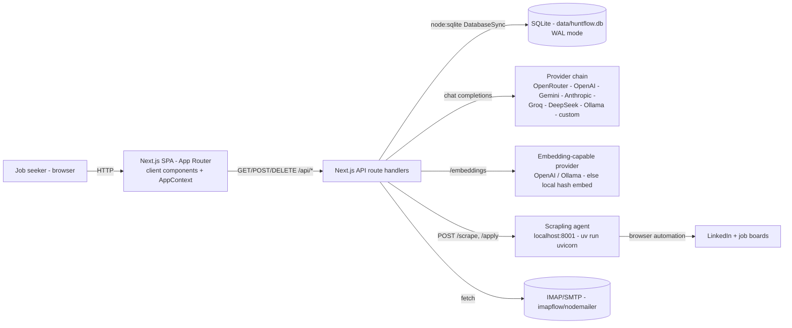
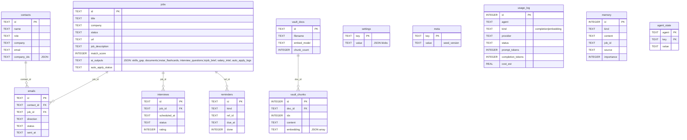
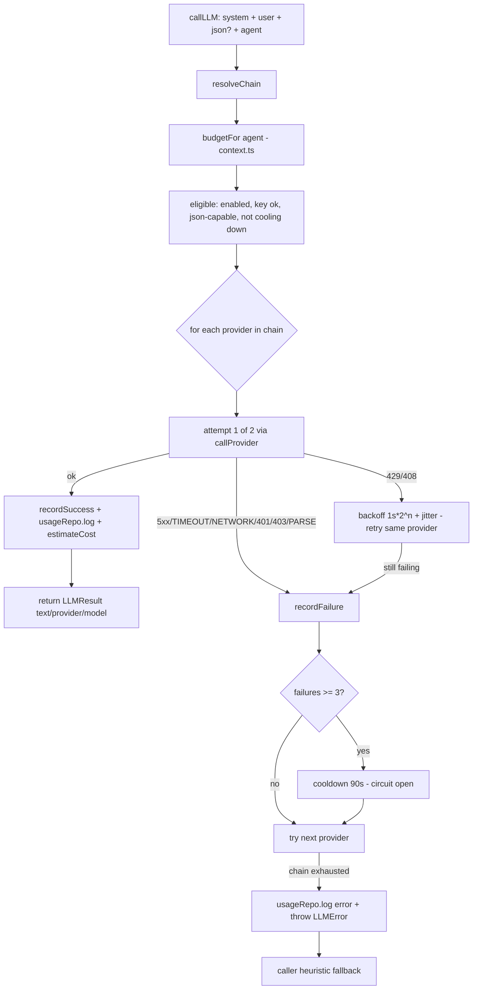
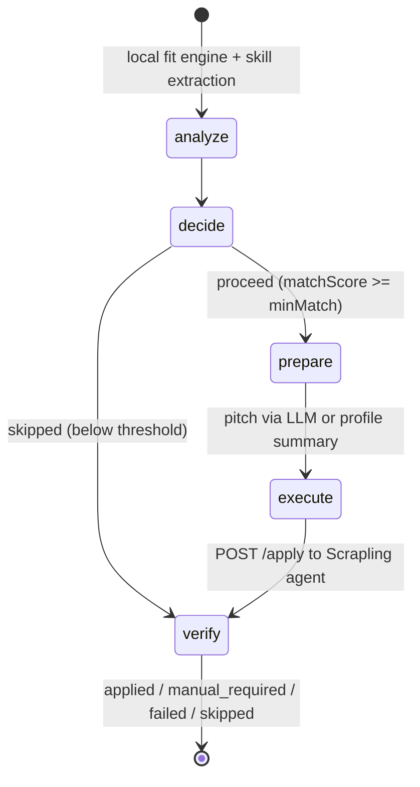
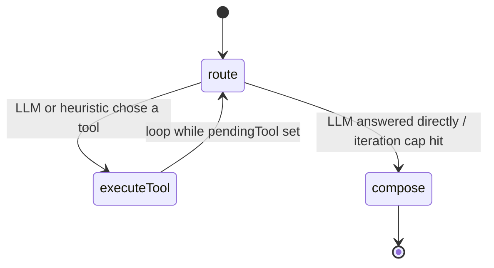
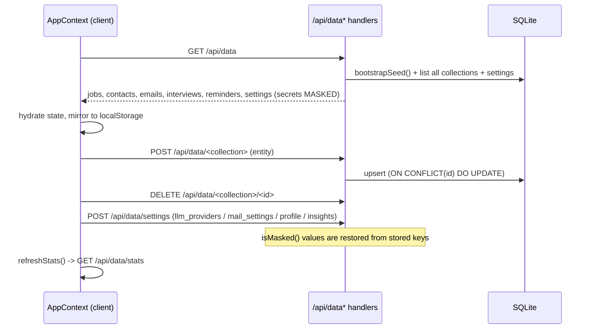

# HUNTFLOW - Architecture

HUNTFLOW is a single-user job-hunt copilot. The UI is a browser SPA built
on the Next.js App Router, and it talks to the server exclusively through
REST endpoints under `/api/*` - there are no server actions. The server
owns a local SQLite database (`data/huntflow.db`), drives a prioritized
chain of LLM providers, and delegates scraping, auto-apply and LinkedIn
work to a separate Scrapling agent (uv-managed, port 8001).

Key files: `src/lib/db.ts` (schema + repos), `src/lib/llm/*` (router,
providers, costs, budgets), `src/agents/*` (LangGraph state machines),
`src/context/AppContext.tsx` (client data hub), `scrapling-agent/`.

## 1. System context

All reads go through `GET /api/data` (a single hydration endpoint); all
writes go through `POST /api/data/<collection>` and
`DELETE /api/data/<collection>/<id>`. Feature APIs (`/api/generate`,
`/api/apply-agent`, `/api/scrape`, `/api/vault`, `/api/assistant`,
`/api/mail/*`, `/api/linkedin/*`) sit on the same database and the same
LLM router. The Scrapling agent is an out-of-process FastAPI/uvicorn
service the server calls for `/scrape` and `/apply`; when offline, the
server falls back to a built-in cheerio extractor (scraping) or a guided
simulation (auto-apply).

## 2. Data model

SQLite via Node's built-in `node:sqlite` driver (`DatabaseSync`), created
lazily with WAL journaling, foreign keys and a 5s busy timeout
(`src/lib/db.ts:getDb`). Rich AI outputs (documents, flashcards, briefs,
skill gaps, auto-apply logs) are JSON columns on `jobs`. `settings` and
`meta` are key/value tables holding JSON blobs (below).

`settings` JSON blobs (written by `AppContext`, read by repos and the
router): `llm_providers` (the ordered provider chain - source of truth
for `resolveChain`), `mail_settings` (IMAP/SMTP, masked passwords),
`profile` and `insights` (mirrors that survive any browser). `meta` holds
`seed_version`; `memory` holds assistant notes/facts/outcomes; `agent_state`
holds per-agent key/value state (e.g. apply-agent last run); `usage_log`
is the LLM usage ledger.

## 3. LLM router

`src/lib/llm/router.ts:callLLM` is the single funnel for every LLM call.
`resolveChain()` merges four sources in order: (1) the DB chain from
`settings.llm_providers` (Settings UI), (2) providers configured via env
vars (`OPENROUTER_API_KEY`, `OPENAI_API_KEY`, `GEMINI_API_KEY`,
`ANTHROPIC_API_KEY`, `GROQ_API_KEY`, `DEEPSEEK_API_KEY` + model vars),
(3) legacy single-provider `llmSettings`, (4) a default OpenRouter entry
(`google/gemini-2.5-flash`).

The router filters to eligible providers (enabled, has key if needed,
supports JSON mode for `json: true` requests, not in cooldown), then
tries each with up to 2 attempts. Failures are classified
(`src/lib/llm/client.ts`): `HTTP_429`/`HTTP_408` retry with exponential
backoff + jitter; `HTTP_5xx`/`TIMEOUT`/`NETWORK`/`HTTP_401`/`HTTP_403`
and JSON `PARSE_ERROR` hop to the next provider. Each failure increments
an in-memory circuit breaker; 3 consecutive failures take a provider out
of rotation for 90 seconds. A fully exhausted chain logs a usage row with
`status: "error"` and throws `LLMError("CHAIN_EXHAUSTED")`; callers fall
back to heuristics so the app keeps working with no provider at all.

Key behaviors:

- **Embeddings disabled for OpenRouter/Gemini**: only providers
  advertising the `embeddings` capability (OpenAI, Ollama - both
  OpenAI-compatible kind) are used for vector search
  (`src/lib/vault/embeddings.ts:embedTexts`); otherwise a deterministic
  local 256-dim hash embedding is used (model label `"local"`).
- **Cost estimation** (`src/lib/llm/costs.ts:estimateCost`): counted
  tokens x per-provider USD/M price, written to `usage_log.cost_est`;
  `ollama` and `custom` always cost 0. **Token budgets**
  (`src/lib/llm/context.ts:GEN_BUDGETS`) clamp every generation type
  (e.g. `chat` maxPrompt 28k, `pitch` 4k); long JD and profile payloads
  are truncated to fit (`truncateHeadTail`/`truncateToTokens`; skills
  capped at 40, experience bullets at 8).
- **Final heuristic fallback**: with no working provider, `matchFallback`
  scores jobs locally and the assistant routes by regex keywords - the
  app never hard-fails on a missing key.

## 4. Apply agent

`src/agents/applyAgent.ts` is a LangGraph `StateGraph` with five nodes:

- `analyze` - scores the role with the local `matchFallback` engine if
  the job has no score yet, and extracts JD terms vs. profile skills.
- `decide` - compares score to `minMatch`; below threshold sets `skipped`
  and jumps to `verify`.
- `prepare` - writes a 3-sentence pitch through the LLM router (agent
  type `pitch`); on failure falls back to the profile summary.
- `execute` - POSTs `{url, profile, documents, submit, min_match,
  match_score}` to `${SCRAPLING_AGENT_URL || http://127.0.0.1:8001}/apply`
  with a 90s abort timeout; the agent inspects the form and either fills
  it (`submit: false` -> prefill) or submits it.
- `verify` - records the terminal status and logs.

Notes:

- `submit: false` (the UI default) yields `manual_required` with detected
  `fields` - an in-memory prefill; the job's `matchScore` is only written
  back when the job had none (`AppContext.tsx:triggerAutoApply`).
- If the Scrapling agent is unreachable the agent degrades to a guided
  simulation: `submit: false` still returns `manual_required` (prefill),
  `submit: true` returns `applied` (simulated - not a real apply).
- `src/app/api/apply-agent/route.ts` wraps the graph, records the run in
  `agent_state` and `memory`, and returns `{status, logs, fields,
  matchScore, decision}` to the client.

## 5. Orchestrator (assistant)

`src/agents/orchestrator.ts:runAssistant` is a LangGraph `StateGraph`
with three nodes arranged as a tool loop:

- `route` - asks the LLM (agent type `orchestrator-route`) to `answer`
  directly or pick one of four tools: `pipeline_summary`, `search_jobs`,
  `search_vault`, `remember`; without a provider it falls back to
  keyword-driven heuristic routing over the same tools.
- `executeTool` - runs the tool against the DB (`jobsRepo`, `emailsRepo`,
  `interviewsRepo`, `remindersRepo`, `searchVault`, `memoryRepo`) and
  stores the result in `toolResult`.
- `compose` - produces the final answer from tool results plus shared
  context; if no provider exists it echoes the tool result verbatim.

Guards: **iteration cap** `MAX_ITERATIONS = 3` (beyond it the loop ends
with a summary of what ran); **duplicate tool guard** reuses the previous
`toolResult` when the same tool would run twice; tool runs are remembered
as `memory` rows (source `assistant`) and surfaced as `usedTools`/`steps`
for the UI transcript.

## 6. Vault / RAG pipeline

`src/lib/vault/*` implements upload -> extract -> chunk -> embed ->
store, and search -> group-by-model -> embed query -> cosine -> top-k.

```mermaid
flowchart TD
  subgraph Ingest
    A1[POST /api/vault - multipart] -->|max 25MB, 413 above| A2[extractText\npdf-parse / mammoth / text]
    A2 --> A3[normalizeText]
    A3 --> A4[chunkText - 700 tokens, 90 overlap]
    A4 --> A5[embedTexts - first embeddings-capable\nprovider or local 256-dim hash]
    A5 --> A6[store vault_docs + vault_chunks\nembed_model pinned per doc]
  end
  subgraph Search
    B1[POST /api/vault/search - query] --> B2[group chunks by embed_model]
    B2 --> B3[embed query with each doc's model]
    B3 --> B4[cosine vs threshold 0.12, sort desc]
    B4 -->|no hits| B5[keyword fallback - terms > 2 chars,\ncoverage > 0.4]
    B5 --> B6[top-k, text sliced to 600 chars]
    B4 --> B6
  end
```

- Chunks are ~700 tokens with 90 tokens of overlap so retrieval keeps
  meaning across boundaries (`chunk.ts`).
- The embedding model is recorded per document (`vault_docs.embed_model`);
  search embeds the query separately for each model group present, so
  documents from different embedding spaces never cross-score.
- `searchVault(query, k=4, threshold=0.12)` returns top-k hits; the
  assistant uses it with `k=3`. Failed ingestion deletes the half-written
  doc; too-short or text-less files are rejected.

## 7. Client <-> API data flow

`src/context/AppContext.tsx` hydrates once on mount from `GET /api/data`
and keeps `localStorage` mirrors as an offline fallback. Every mutation
is a write-through: local state updates immediately, then the entity is
POSTed to the per-collection endpoint (`POST /api/data/<collection>`
upserts; `DELETE /api/data/<collection>/<id>` removes). Profile, insights
and mail settings persist to `settings` on change; `/api/data/stats`
provides analytics (funnel, weekly, response rate, overdue follow-ups,
upcoming interviews, top companies).

Deep links: `/tracker?open=<jobId>` opens the job detail drawer
(`setActiveJobId`), `/tracker?add=1` opens the add-job modal; the tracker
clears the query string after consuming it.

## 8. Secrets, reset and security

**Secrets handling** (`src/lib/masking.ts`, `src/app/api/data/*`):
`GET /api/data` masks `llm_providers[].apiKey` and
`mail_settings.imapPass/smtpPass` via `maskSecret()` (mask prefix + last
4 characters) - real keys never reach the browser. On save,
`POST /api/data/settings` runs `restoreProviderKeys()` /
`restoreMailSecrets()`: incoming values that `isMasked()` are replaced
with the stored key before writing, so the UI round-trips masked values
without ever seeing the real secret.

**Reset / re-seed** (`src/lib/db.ts:bootstrapSeed`, `POST /api/data/reset`):
`bootstrapSeed()` runs on every `GET /api/data`; if `meta.seed_version`
is not `"1"` and the jobs table is empty it inserts the seed register and
marks `seed_version = 1` (a non-empty table is just marked). The reset
endpoint deletes `jobs, contacts, emails, interviews, reminders, memory,
agent_state, vault_chunks, vault_docs`, clears `seed_version` and
re-seeds; `settings` (including API keys) survives.

**Security:**

- SSRF guard in `src/app/api/scrape/route.ts:assertPublicUrl`: only
  http(s) allowed; blocks `localhost`/`.localhost`, loopback, link-local
  (169.254.x.x) and private IPv4 ranges (0.x, 10/8, 127/8, 172.16/12,
  192.168/16) before any fetch happens.
- Vault uploads capped at 25 MB (`MAX_UPLOAD_BYTES`, HTTP 413 beyond);
  per-agent prompt budgets, truncated JD/profile payloads, scrape
  description capped at 4000 chars and vault hit text sliced to 600 chars
  keep costs and latency bounded.
- Local-first: the DB is a single file in `data/`; nothing leaves the
  machine except provider API calls and the Scrapling agent's traffic.

## 9. Known limitations

- **No real credentials in development flows**: IMAP/SMTP mail sync/send
  and LinkedIn session/profile/jobs require live credentials and the
  Scrapling agent; without them calls degrade gracefully (sync skipped,
  guided simulation) rather than failing the app.
- **`npm run start` is production only**: it serves a prior `next build`
  output; use `npm run dev` during development.
- **Ports**: Next.js on 3000, Scrapling agent on 8001 (overridable with
  `SCRAPLING_AGENT_URL`), Ollama on 11434 when used.
- **In-memory circuit breaker**: provider cooldown state resets when the
  server restarts.
- **Auto-apply submission is only real through the Scrapling agent**; the
  built-in fallback simulates the apply and never submits to a live form.
