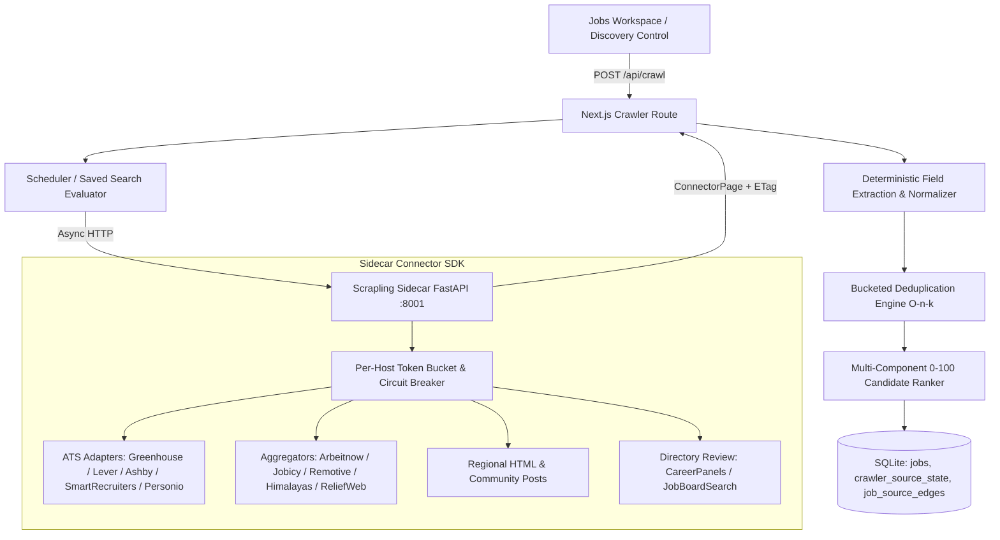

# Global Crawler Network Architecture

HUNTFLOW implements a **demand-driven, multi-channel job discovery network** designed for local-first execution.
It indexes opportunities across direct company ATS systems, open aggregators, regional boards, and community forums.

## Architectural Principles

1. **Demand-Driven Local Indexing**: Rather than attempting a complete mirror of the public internet, HUNTFLOW indexes sources on-demand based on explicit user searches, saved searches, and company board discovery.
2. **Deterministic Extraction Before LLM**: Role family, seniority (intern/junior/mid/senior/staff/lead/principal), work mode (remote/hybrid/onsite), employment type, salary bands, explicit visa signals, and tech tags are extracted deterministically with regex and token normalization without calling an LLM.
3. **High-Performance Bucketed Deduplication**: Replaces $O(n^2)$ all-pairs scanning with candidate buckets:
   - $O(1)$ exact canonical URL matching
   - $O(k)$ company bucket matching using title token Jaccard similarity ($>70\%$ overlap)
   - Preserves every origin in `job_source_edges` and increments `sourcesCount` on the canonical job.
4. **Conditional Polling & Incremental Sync**:
   - Stores ETags, Last-Modified timestamps, and SHA-256 normalized content hashes in `crawler_source_state`.
   - Returns 304 Not Modified without reparsing or rewriting jobs.
5. **Two-Strike Job Closing Policy**:
   - A posting missing from one successful sync remains active.
   - It is marked closed only after two consecutive complete, successful syncs of that source omit the external ID.
   - Partial or failed syncs never close jobs.
6. **Rate Limiting & Circuit Breaking**:
   - Per-host token buckets configured via `perDomainRps`.
   - Bounded global concurrency of 10 workers.
   - 3 consecutive failures trip a 90-second circuit breaker.
7. **Community Filter List Driven Adblocking & Anti-Bot Shield**:
   - Automates downloads and compilation of standard community lists: EasyList, EasyPrivacy, Peter Lowe's List, and cosmetic rules.
   - Employs an $O(1)$ fast domain-suffix lookup tree and regex path rules to abort ad/tracker calls at the network route level.
   - Injects cosmetic element-hiding CSS (`.ad, .adbox, .banner_ads, .textads, ...`) to eliminate visual ad containers.
   - Defuses anti-adblock detection scripts via mock JavaScript flags (`window.canRunAds = true`).
8. **Browser Stealth & Session Persistence**:
   - Removes `navigator.webdriver` via prototype descriptor redefinition.
   - Spoofs realistic WebGL vendor/renderer (`ANGLE Direct3D11 / NVIDIA`).
   - Injects sub-perceptible canvas/audio noise to prevent deterministic device fingerprinting.
   - Maintains an offline-first, persistent `CookieJarManager` pre-seeding GDPR/CCPA consent tokens (`OptanonAlertBoxClosed`, `CookieConsent`) to bypass consent blocking modals.

## Supported Channel Taxonomy

| Channel | Identifier | Description | Default Policy |
| --- | --- | --- | --- |
| **Direct ATS** | `ats` | Structured JSON & XML feeds from Greenhouse, Lever, Ashby, SmartRecruiters, Personio, Recruitee, Workable. | `automatic` |
| **Aggregator** | `aggregator` | Open developer APIs from Arbeitnow, Jobicy, Remotive, Himalayas, ReliefWeb; optional-key APIs from The Muse, Adzuna, Jooble, Findwork, USAJobs. | `automatic` |
| **Regional Portals** | `regional` | HTML & RSS feeds for Tunisia (ANETI, Keejob, TanitJobs, Emploitunisie), MENA, Africa, Europe, APAC, Americas. | `disabled` (pending live canary) |
| **Community Forums** | `community` | Structured hiring threads such as Hacker News Who Is Hiring. | `automatic` |
| **Directories** | `directory` | Candidate board discovery (CareerPanels, JobBoardSearch) for operator review. | `manual_only` |
